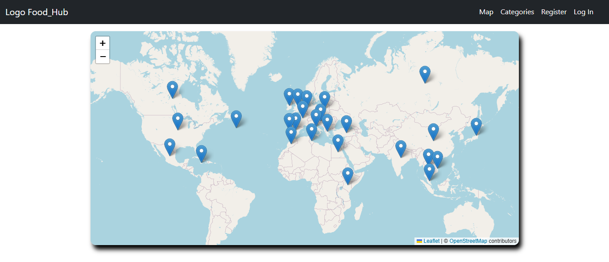

# Food Hub 🍔🚀



Proyecto **Food Hub** para gestión de pedidos y visualización de productos de comida, desarrollado en:

* **Frontend:** React 18 (Create React App)
* **Backend:** Node.js + Express
* **Base de Datos:** MongoDB local

---

## 🚀 Requisitos previos

- ✅ **Node.js** y **NPM** instalados ([descargar aquí](https://nodejs.org)).
- ✅ **MongoDB** instalado local o conexión a MongoDB Compass/VSCode Mongo plugin.

---

## 📦 Instalación del proyecto

```bash
git clone https://github.com/PipeRucinque/food-hub.git
cd food-hub
```

> [!IMPORTANT]  
> Pídeme las variables de entorno a luis.felipe.rucinque@gmail.com

- ### 🗄️ Instalación de dependencias y ejecución de Backend
```bash
cd server
npm install
npm run dev
```
- ### 💻 Instalación de dependencias y ejecución de Frontend
```bash
cd client
npm install
npm start
```

> [!NOTE] 
> Abrirá automáticamente en:
> http://localhost:3000